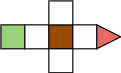

# Rosie

A 2D block pushing game with a mechanic to add complexity and a new approach to the genre. While the game is two dimensional, it is based within a three dimensional field; bearing the x, y & z coordinates. The added mechanic is the ability to revert an action which the player had made. This action only occurs from blocks pushed by the player. The design of the first level has been laid out below.

In the level above, you can push the block forward, then sitting in either of the sides you can retract your move. This will pull the block back allowing you to push it into the other slot. This gives you access to the goal which is marked as the red arrow on the map. This mechanic in turn with new gimmicks should offer an easy mobile game experience or one which players can do on their computer too.
