# Rosie

A 2D block pushing game with a mechanic to add complexity and a new approach to the genre. While the game is two dimensional, it is based within a three dimensional field; bearing the x, y & z coordinates. The added mechanic is the ability to revert an action which the player had made. This action only occurs from blocks pushed by the player. The design of the first level has been laid out below.

<div align="center">

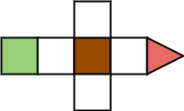

*Figure a.1: First Level Design*

</div>

In the level above, you can push the block forward, then sitting in either of the sides you can retract your move. This will pull the block back allowing you to push it into the other slot. This gives you access to the goal which is marked as the red arrow on the map. This mechanic in turn with new gimmicks should offer an easy mobile game experience or one which players can do on their computer too.

## Architecture

### Event Cycle

The game will follow a strict event cycle which **will not** be broken. This is to ensure simplicity in design and development. The event cycle is as follows;

1. **Player Input** - an event cannot be played without the input of the player. Should the player not input an action; the game will continue to render but no logic is pressed.
2. **Player Action** - Based on the input given; the player character will react accordingly. An example of this could be the player moving in a given direction.
3. **Level Reaction** - This step can be missed if the player character did not interact with a level element that wasn't themselves. An example of a level action would be a block being pushed.
4. **Physics Update** - Rosie holds a very simple physics environment. This would extend to the conerns of heavy gravity and weight comparisons when a binary force is applied. This physics update would be applied to all elements within the level; including the player's character which may have been pushed off a ledge.
5. **Status Check** - Once the physics update has been performed; the game checks any logical flags. This could include; the player having died via being crushed by a block. The player having completed a level by reaching the goal tile.

### Block Element

A block's size should be varied, allowing for greater flexibility in design. For this reason; a block cannot have its location pointed to one coordinate on the map. Instead, each space of the 3D map which is taken by the block should be considered as its coordinates. When a block moves, each of its coordinates should be updated as well as asserted to ensure it can be updated. Look at the example diagram below;

<div align="center">

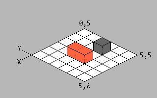

*Figure b.1: Initial Map Position*

</div>

In this space; two axes have been labelled, X and Y. For the sake of simplicity we'll be ignoring the third dimension for the time being. Our Standard Block which is coloured orange occupies two coordinates on the map `2,2` & `3,2`. A wall also exists within our example, on the tile `3,4`.

Let's define our cardinal directions as the following;
- **North:** `0,1`
- **East:** `1,0`
- **South:** `0,-1`
- **West:** `-1,0`

If we apply a north directed force to our Standard Block it should assert whether each of its occupied coordinates can perform the transform successfully.

```
pA[ 2, 2 ] + d[ 0, 1 ] = p2[ 2, 3 ]
Check whether p2 is valid
pB[ 3, 2 ] + d[ 0, 1 ] = p2[ 3, 3 ]
Again, check whether p2 is valid
```

Looking at the map we know the `p2` positions to be transformed to are valid as they are empty and within the bounds of the map. Therefore, the Standard Block can move north within our map. Now, we have the map below;

<div align="center">

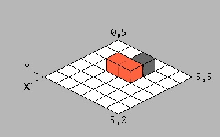

*Figure b.2: New Map Position*

</div>

## Design

### Gimmicks

The mechanism of this game is straightforward, combining it with gimmicks in levels or elements wtihin them; a more interesting environment can be created. Below, some gimmicks which have been pre-thought are listed.

#### **Standard Block**

While being the ordinary of the game, it still has some features which are worth noting in this series.

1. Can be pushed by the player's character.

<div align="center">

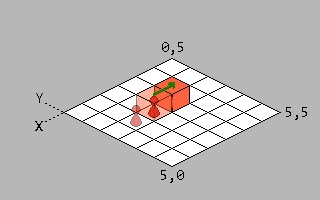

*Figure c.1: Standard Block Movement*

</div>

2. Two standard blocks cannot be pushed in their connected direction.

<div align="center">

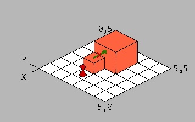

*Figure c.2: Standard Block Invalid Connected Block Movement*

</div>

3. When a standard block's push has been reverted; it will push the character.

<div align="center">

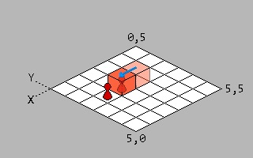

*Figure c.3: Standard Block Reverted Against Player*

</div>

4. A standard block being reverted against the player's character into a wall will kill them.

<div align="center">

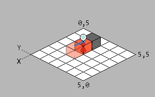

*Figure c.4: Standard Block Reverted Onto Player Against Wall*

</div>

5. A standard block being reverted against another standard block will push it but not when towards a wall.

<div align="center">

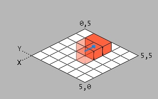

*Figure c.5: Standard Block Reverted Against Another Standard Block*

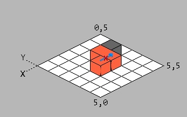

*Figure c.6: Standard Block Invalid Inversion Against Wall*

</div>

6. If a Standard Block is to fall on the player's character, it will kill them.

<div align="center">

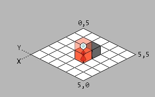

*Figure c.7: Standard Block Falling Onto Player*

</div>

7. A Standard Block cannot be pushed into a wall

<div align="center">

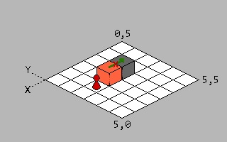

*Figure c.8: Standard Block Invalid Wall Movement*

</div>

#### **Paper Block**

A light version of the standard block.
- Can be pushed by the player's character.
- Any number of paper blocks can be pushed together.
- A reverted paper block will not push another paper block, standard block or the player's character.
- Will be crushed when a standard block reverts against it into a wall.
- If a Paper Block is to fall on the player's character, it will remain above them until the character's player moves away and a 'physics update' is performed.

#### **Magnet Block**

Acts identically to the Standard Block but has extended behaviour.
- When a Magnet Block connects with another magnet block; it joins to form one element within the world.
- When magnetizing, memory which related to each separate entity is overlapped.
- Even when magnetized to form a larger entity, it still will act the same as the standard block in core behaviour.

#### **Goo Block**

A unique block which shares some similarish behaviours with the Magnet and Paper Block.
- Can be pushed by the player's character.
- When pushed against another goo block; it will form one larger goo block will moving in the pushed direction.
- A large goo block will adjust its shape when only a portion of it can perform a transformation due to a map edge, wall or Standard Block (see images for clarity).
- If a Goo Block falls on the player's character, they won't be hurt, but instead; will emerge from the top of the Goo Block.
- A Goo Block being reverted against the player's character will cause the block to engulf the player's character and emit them at the top.

#### **Temple Block (Better Name TBD)**

Very different in behaviour to Standard Blocks.
- Cannot be pushed by the player's character.
- Gravity is not applied to these blocks and they can remain in the air.
- When the player presses the action button while facing a Temple Block, the character is locked but has the ability to move the block in a 3-dimensional direction. That being UP, DOWN, LEFT or RIGHT. Left and Right being from the perspective of the player's character.
- In terms of pushing, these blocks act the same as Standard Blocks. Meaning, they can't be pushed towards another Temple Block they are against or towards a wall.